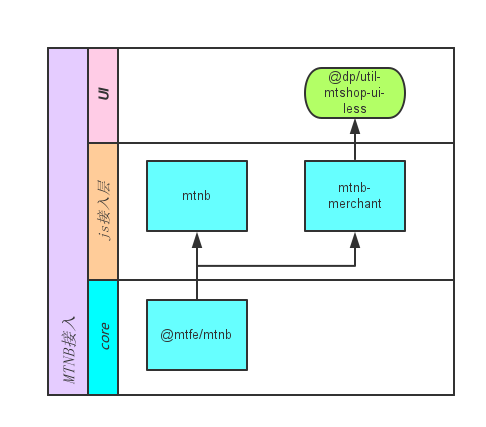

# 概述

MTNB(meituan native bridge)，是用来在混合应用开发中打通客户端应用（美团app，开店宝，猫眼等）与网页应用信道的桥梁。MTNB也作为美团移动桥协议在webapp中的命名空间存在。
[详细文档](http://wiki.sankuai.com/display/DEVPUB/Meituan+Native+Bridge)



* mtnb-core由美团的npm模块提供，业务方不需要关心。
* mtnb和mtnb-merchant依赖于mtnb-core，并封装了BA认证过程，业务方不需要关心，直接调用即可。
* mtnb-merchant扩展了两部分功能，native支持的和js mock的接口。
* @dp/util-mtshop-ui-less提供了基础样式组件以及mtnb-merchant js相关UI接口的样式。

# 引入
使用MTNB需要通过BA认证，因此需要访问后端接口拿到authInfo，前端使用authInfo鉴权，通过鉴权才可以使用jsbridge提供的功能。

以上BA认证过程已经在mtnb以及mtnb-merchant中包装好，直接调用即可。

```javascript
var MTNB = require('mtnb');
var MTNB = require('mtnb-merchant');
```

[mtnb](http://code.dianpingoa.com/ed-f2e/mtnb)及[开店宝mtnb](http://code.dianpingoa.com/ed-f2e/mtnb-merchant)目前仅支持通过Cortex方式引入。

点评侧对mtnb-merchant做了二次封装，提供了UI及storage的一些功能。

# 初始化
```javascript
MTNB.ready(function() {
	// 业务代码
	MTNB.use(...);
});
```
<aside class="warning">MTNB中所有和native相关的接口都需要在鉴权成功(MTNB.ready)后使用。</aside>

# 基础模块

## 关闭当前webview
```javascript
MTNB.use('webview.close', {
	anime: "slideleft"
});
```
模块/app | 版本
--- | ---
mtnb | 0.3.0+
mtnb-merchant | 0.2.0+
开店宝 | 4.9.0+

<aside class="warning">在MTNB.init成功回调之后才可使用</aside>
type | name | 描述
--- | ---- | ----
string | anime | 关闭时执行的动画，如果不传，按照打开的反向动画执行

## 打开新的webview
```javascript
MTNB.use('webview.open', {
	url: 'http://i.meiutan.com/',
	anime: "slideleft"
});
```
<aside class="warning">在MTNB.ready中使用</aside>

模块/app | 版本
--- | ---
mtnb | 0.3.0+
mtnb-merchant | 0.2.0+
开店宝 | 4.9.0+

type | name | 说明
--- | --- | ----
string | url	| 打开的地址
string	| anime	| 动画类型：swipeLeft, swipeRight 左右切换；fadeIn, fadeOut 淡入淡出


## 设置webview标题
```javascript
MTNB.use('webview.setTitle', {
    title: "一个很长很长的标题",
    callback: function () {
        // 标题被点击后的操作...
    }
});
```
<aside class="warning">在MTNB.ready中使用</aside>

模块/app | 版本
--- | ---
mtnb | 0.3.0+
mtnb-merchant | 0.2.0+
开店宝 | 4.9.0+

type | name | 说明
--- | --- | ----
function	|callback	| 监听标题点击的回调
string | title	| 标题名称


## 设置复杂的webview标题
```javascript
MTNB.use('webview.setHtmlTitle', {
    title: "<font size="4" face="arial" color="black">演唱会 </font><font size="2" color="black"> 北京</font><font size="1" color="black">▼</font>",
    callback: function () {
        // 标题被点击后的操作...
    }
});
```
<aside class="warning">在MTNB.ready中使用</aside>
<aside class="warning">不支持换行</aside>

模块/app | 版本
--- | ---
mtnb | 0.3.0+
mtnb-merchant | 0.2.0+
开店宝 | 4.9.0+

type | name | 说明
--- | --- | ----
string	| title | 标题名称，使用font来实现
function | callback | 监听标题点击的回调


## 设置角标
```javascript
// 分享
MTNB.use('webview.setIcon', {
    type: "share",
    channel: 385,
    url: location.href,
    title: document.title,
    pic: $('img').attr('src'),
    callback: function () {
        // 分享完成后的回调
    }
});
// 链接
MTNB.use('webview.setIcon', {
    type: "text",
    text: "退款帮助",
    url: "i.meituan.com/help/refund",
    callback: function () {
        // 点击分享的回调
    }
});
// 回调
MTNB.use('webview.setIcon', {
    type: "text",
    text: "设置提醒",
    callback: function () {
        // 点击提醒的回调
    },
});
// 设置多个icon
MTNB.use('webview.setIcon', [
    {
        type: "text",
        text: "设置提醒",
        callback: function () {
            // 交互
        }
    },
    {
        type: "text",
        text: "收藏",
        callback: function () {
            // 交互
        }
    }
]);
```
<aside class="warning">在MTNB.ready中使用</aside>

模块/app | 版本
--- | ---
mtnb | 0.3.0+
mtnb-merchant | 0.2.0+
开店宝 | 4.9.0+

type | name | 说明
--- | --- | ----
object|	data|	附加数据，其中的callback为事件触发后的回调，参数是{}
string|	type|	icon类型，“text”文字，“share”分享

## 订制左上角按钮
```javascript
	var params = {};
    if (location.search) {
        location.search.substr(1).split('&').map(function(search) {
            var pare = search.split('=');
            params[pare[0]] = decodeURIComponent(pare[1]);
        });
    }
    if (!params.reloaded) {
        params.reloaded = 1;
        var queryArray = [];
        for (var k in params) {
            queryArray.push(k + '=' + params[k]);
        }
        location.href = location.protocol + '//' + location.host + location.pathname + '?' + queryArray.join('&');
    }
```

开店宝左上角按钮，请参考[此文档](http://wiki.sankuai.com/pages/viewpage.action?pageId=372249318)

因为android没有完全实现webview相关的接口，尤其是webview.open，所以推荐使用location.href的方式进行页面跳转。

开店宝webview有一个已知的bug是：webview打开页面A跳转页面B，再点返回直接关闭webview，针对此问题的解决方法是，页面加载完自动进行一次页面跳转，示例代码见右侧：

# 开店宝订制-native接口
<aside class="success">以下接口只在开店宝APP中可用，在开店宝APP中请使用mtnb-merchant。</aside>

```
var MTNB = require('mtnb-merchant');
```

todo: http://wiki.sankuai.com/pages/viewpage.action?pageId=413045245

## API1
## API2
## API3
## API4

# 开店宝订制-js接口

mtnb-merchant中点评开发环境提供的js功能，通过extend方式挂在MTNB对象上。

js接口只生成dom，样式需要额外依赖或者自己实现，请使用符合开店宝视觉规范的UI组件：[开店宝基础样式组件](http://code.dianpingoa.com/ed-f2e/util-mtshop-m-less-demo/tree/master)。

<aside class="success">不需要在ready中调用。</aside>

## alert
```javascript
MTNB.alert({
    title: 'title', // 标题文字
    message: 'message', // 内容文字
    button: 'button', // 按钮文字
    success: function(){
        // 用户点击确认
    }
});
```
弹出类似于window.alert的结构。
<aside class="success">mtnb-merchant@0.2.0+</aside>
<aside class="success">不需要在ready中调用。</aside>
<aside class="warning">请使用@dp/util-mtshop-m-less</aside>

## confirm
```javascript
MTNB.confirm({
    title: 'title', // 标题文字
    message: 'message', // 内容文字
    okButton: 'OK', // 确认按钮文字
    cancelButton: 'Cancel', // 取消按钮文字
    success: function(e) {
        // 用户点击确认或取消
        if (e.ret) {} // true: 确认 false: 取消
    }
});
```
弹出类似于window.confirm的结构，有确定和取消的点击回调。
<aside class="success">mtnb-merchant@0.2.0+</aside>
<aside class="success">不需要在ready中调用。</aside>
<aside class="warning">请使用@dp/util-mtshop-m-less</aside>

## toast
```javascript
MTNB.toast({
    title: 'title', // 文字
    timeout: 2000 // 持续时间
});
```
弹出一段简短的信息，一定时间后消失。
<aside class="success">mtnb-merchant@0.2.0+</aside>
<aside class="success">不需要在ready中调用。</aside>
<aside class="warning">请使用@dp/util-mtshop-m-less</aside>

## tooltip
```javascript
MTNB.tooltip({
	targetEl: $('.level_func'),// zepto object
	placement: 'right',// top/right/bottom/left
	message: '请设置会员等级权益，否则<br>该会员卡无法正式启用', //可以传入string或者html
	timeout: 3000 // 3000ms后自动消失
});
```
带箭头的，在指定位置出现的，一定时间后自动消失的提示信息。
<aside class="success">mtnb-merchant@0.2.0+</aside>
<aside class="success">不需要在ready中调用。</aside>
<aside class="warning">请使用@dp/util-mtshop-m-less</aside>

## loading

todo

## store

```javascript
MTNB.config({
	bizname: 'app-mtb-club'// 通常使用包名
});
MTNB.store({
	key: "key",
	value: "value"
	success: function(){
    	// 存值成功
	}
});
```
使用localStorage储值，value必须是字符串。
<aside class="success">mtnb-merchant@0.2.0+</aside>
<aside class="success">不需要在ready中调用。</aside>
<aside class="warning">使用前需要先使用`MTNB.config({bizname:“your-biz-name”});`进行配置</aside>
## retrieve

```javascript
MTNB.config({
	bizname: 'app-mtb-club'// 通常使用包名
});
MTNB.retrieve({
	key: 'key',
	success: function(e) {
		alert(e.value);
	}
});
```
取store的值。
<aside class="success">mtnb-merchant@0.2.0+</aside>
<aside class="success">不需要在ready中调用。</aside>
<aside class="warning">使用前需要先使用`MTNB.config({bizname:“your-biz-name”});`进行配置</aside>

## del
```javascript
MTNB.config({
	bizname: 'app-mtb-club'// 通常使用包名
});
MTNB.del({
	key: 'key',
	success: function(e) {
		// del success
	}
});
```
删除store的值。
<aside class="success">mtnb-merchant@0.2.0+</aside>
<aside class="success">不需要在ready中调用。</aside>
<aside class="warning">使用前需要先使用`MTNB.config({bizname:“your-biz-name”});`进行配置</aside>


